# How it Works: The Building Blocks

Primero is an information management system that allows for data entry and reporting for child protection. The system helps intake relevant information via multiple sources, consolidates the information into relevant record types \(Cases \/ Incidents \/ Tracing Requests\) and allows service providers to report and make educated decisions to assist in these locations.

## Components

Primero is made up of multiple **components**. The current implemented Primero components are:

* **Cases**, which track an individual beneficiary\/survivor. Different information is captured for CP and GBV cases.

* **Incidents**, specifically incidents of gender-based violence reported by individuals.

* **Tracing Requests**, which describe an attempt by an inquirer to trace, locate, and reunify separated children.


## Modules

Many aspects of Primero are configurable. This configuration is performed through **modules**. Modules represent how the system will be used and contain a default set of forms. Primero typically includes the following modules by default::

* **Child Protection \(CP\)**: This module includes child protection case management and tracing request capability to aid in family tracing and reunification.

* **Gender Based Violence \(GBV\)**: This module includes case management and incident tracking for gender-based violence service providers.


Each module comes with module-specific components and a default set of forms and other configurations. While there appears to be some overlap between the modules - both CP and GBV have cases - each module has a unique set of forms. In some cases, fields, like name and date of birth, may be shared among the forms across modules.

## Programs

Modules belong to **Programs** which represent a mandate for the application as provided by the steering committee for certain programs using Primero. An example of a program is child protection work within certain zones of a particular refugee camp. Application functionality cannot be configured within a program. The program configuration only provides descriptive information about the application’s mission. This should not be edited.

## Users

Primero **Users** are the individuals working for service-providing organizations and agencies who use the system.

## User Groups

**User Groups** represent teams of users working together. For example, there may be a team of social workers in a particular refugee camp providing services to children. There may be another team responsible for the child’s best interest determination. A **manager** of a user group will have some level of access to all of the data managed by that group, but not to the data managed by a different group.

## Roles

Users will have **Roles**, which define what particular users are allowed to do: read records, modify records, run reports, configure the system. Examples of roles are Social Worker, \CP Manager, and CP Administrator.

Along with defining what actions the user is allowed to perform, roles also limit what kind of information is visible about individual records for a specific user. For example, a CP Social Worker may be allowed to view and edit personally identifiable information \(such as name, age, and sex\) about a particular client, while a CP Manager may only see a reduced set of information about that same person \(age and sex, but not the name\), and may not be allowed to edit any of it.

The general term for these limits to what the user can do and what a user can see is **authorization**.

## Records

A **record** tracks to the components that are implemented in Primero. The three permitted record types are cases, incidents, and tracing requests.

## Fields

A **field** \(data field\) is information within a record. Fields are attributes like name, age, date of birth. Sometimes one field can be used to store several values like a list of protection concerns or all the languages spoken. Fields types include:

* Text

* Text Area

* Date

* Tick Box

* Select Drop Down \(single-select or multi-select\)

* Radio Button

* Numeric Field

* Tally Field

* Date Field \/ Date Range


Each of these field types is defined with an example in section 4.2 below.

## Forms

A **form** contains a set of fields for a record. By configuring the Primero application, you can specify new fields on a form, reorder the fields, or allow different forms to share the same field. For example, the standard form and field set for a child protection case has a form called “Preliminary Protection Concerns” which has a field listing the protection concerns related to the individual beneficiary\/survivor where multiple values can be selected. Further down, there is a different form called “Protection Concerns” which contains the same list \(for reference\) and an ability to elaborate on each protection concern with an additional set of fields. This narrows the information in each form and allows the form to be targeted to a particular purpose or a step in the case management workflow.

## Form Groups

A **Form Group** is visible in the form navigation panel on the left side of the screen and can contain a single form or be expanded to show multiple forms. When multiple forms are added to a group, it becomes expandable\/ collapsible; if the group contains one form, there is no expand or collapse functionality. This allows for the form navigation panel to be organized in concise, navigable groupings to keep the panel shorter and easier to use. For example, the Identity\/Registration form group includes all forms specific to the identity \(Basic Identity, Preliminary Protection Concerns\) and registration \(Interview Details\) of a case. The form group to which each form belongs is configured on creation or edit.

# User and Role Management

As described above, each Primero user has a combination of at least one role and one user group that allows them to access the functions and records required to support their business role within the service-providing organizations and agencies that use the Primero implementation. User management consists of the following three elements:

* **Users** are the individuals using Primero who each have a unique username and password. Each user is given access to one or more modules in Primero \(e.g., CP for case management\).

* Their **Role** sets which actions they can perform on which records - “read,” “flag,” and export,” on Cases, but only “read” on Users and User Groups, etc. - and the breadth of data they can see - their own, their group’s, or all; as well as the roles that they can manage.

* Their **User Group** creates teams of users who can share information. However, what the users in this group can see is governed by the breadth of data set in the role.


Each of these elements is created and edited from Manage Users functionality in the Settings option in the Main Navigation Menu across the top of the screen:

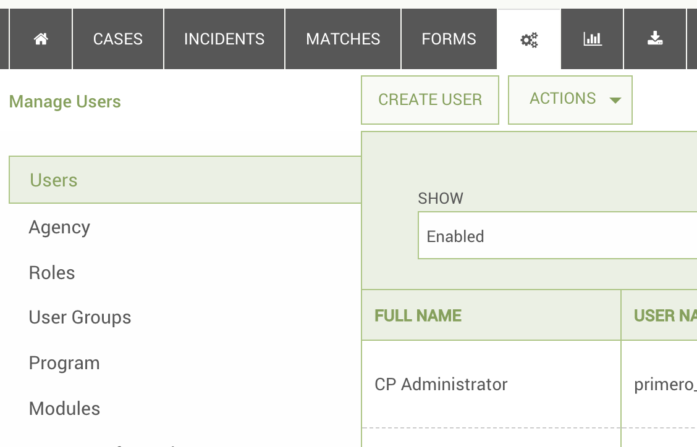

Since Users are built using Roles and User Groups, it is important to create these first before creating individual Users.

_**_IMPORTANT:_**_

**_Every user must have access to the corresponding Record Owner form on the module you wish for them to access._** To accomplish this, you can select no forms at all, which will defer to pre-defined forms access. Most likely you will be selecting individual forms for each module the user’s role can access as they will not need to see all default forms. **_Once you select a single form for a role to access, you must select all forms you wish the role to access._**

## Creating and Editing User Roles

A User Role sets the following:

* Permissions - What actions the user with this role can perform on which resources\(i.e. read and write on Cases, but only export on Tracing Requests.\) Most users will not need permissions on system-oriented resources such as Users and Groups; Roles; Forms; Lookups; and System.

* Management - The breadth of data this role can see. The options are: “Access only my records,” “Access all records owned by users in my group,” and “Access all records.”

* Role Management - Which roles the role is able to manage. This setting is found as a permission under the “Role” resource.

* Forms - The specific forms a user with this role sees. All fields on the form will be visible if the user can see the form.

* Dashboards- The information the user will see on the dashboard when first logging in. The options are “View Approvals,” “View Assessment,” and “Manage.” If either of the first two are selected, the user will see these items on the dashboard. If “Manage” is selected, it overrides the other permissions checked and gives access to all options in the section.


It is important to note that once a role has been created, it cannot be deleted. The role can only be disabled. It is important to reiterate that, when you are modifying a role’s permissions, you must modify them for each type of record you want the role to be able to handle. So, for instance, if you wanted a role to be able to write to, read from, and export cases, you would need to specifically check the ‘write,’ ‘read,’ and ‘export’ boxes under the ‘case’ section of the role form. If you wanted your role to only be able to read from tracing requests, you would only check the ‘read’ box in the ‘tracing request’ section. If you wanted to make sure the role had no access whatsoever to the user record, then you would check nothing in the ‘user’ section. On the other hand, if you want to grant all available permissions on a particular type of resource, you can always just check the ‘manage’ box, which will signal that the role has all permissions for that resource and save you a bit of time in the process.

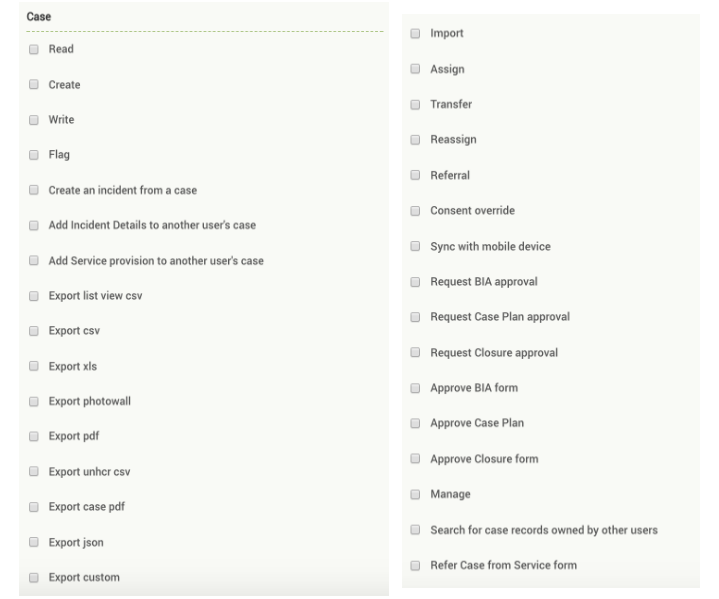

To create a new role, use the following process:

1. Navigate to the Users page using the SETTINGS link in the navigation bar.

2. Select the _Roles_ link in the left panel navigation.


## 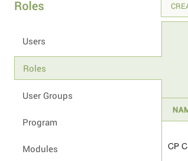 {#section-3}

1. Once selected, click the CREATE ROLE button to bring up the creation form.

## 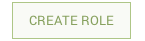 {#section-5}

1. In the Role Creation Form, you can set what Actions, Resources, Management, and Forms a User with this role can access. Click on the SAVE button once all the desired information is entered.

2. It is required that a user have access to **“Record Owner”** form. A user cannot edit this form, but access will be needed for the system to allow the user to access the record type.


To edit the properties of an existing role, find the name and click _Edit_ in the options in the right column. From the _Show_ page, click the EDIT button at the top of the screen. We highly recommend that a role never be deleted unless it was created in error as this may have a negative impact on any users who have been assigned the role. Click on the SAVE button once all the desired information has been changed or entered.

A few hints for setting roles:

* When creating the role, if you do not check any forms, users with this role will see the default set of forms for the modules assigned when their username is created. However, if you check even one form in Case, Incident, or Tracing Requests, you must click all the forms the role should access in all three groups of forms.

* Record Owner is a required form. If you are selecting forms, you must include Record Owner with any other forms within the group otherwise users with this role will be crippled. The Record Owner form must be selected within each group of Case, Incident and Tracing Request forms. Selecting it once is not adequate.

* The list of forms for Cases contains forms for both the CP and GBV modules and, likewise. For the user to see the form, the role must have access to the form and the username must have access to the module.


## Creating and Editing User Groups

**User Groups** are used to create teams of users and allow different levels of access to records within the group. As with Roles, this should be set up before creating individual users. Access to the records within a User Group is determined within the role as follows:

* Access only my records

* Access all records owned by users in my group

* Access all records

* No access - Admin functionality only


The actions the user can perform once they have access to a record are driven by the privileges set with their role. These permissions given to a user apply to all records they have access to. If a user has write access to their own records, and also happens to have access to the records of anyone in their user group, then their write access will also apply to their user group access, meaning they can make changes to any files owned by members of the user group. A user whose role has access to all records, and has write access for cases, would obviously be able to make changes to any case. Some users, however, may have a role with no record access. These roles are meant for users who act solely as system administrators--managing users, forms, agencies, etc.--without being able to access cases, incidents, and tracing requests.

The following diagram helps explain the relationship between Users, Roles, and User Groups through a hypothetical Role\/User Group setup, where the different roles are given specific permissions regarding their ability to see records within different User Groups:

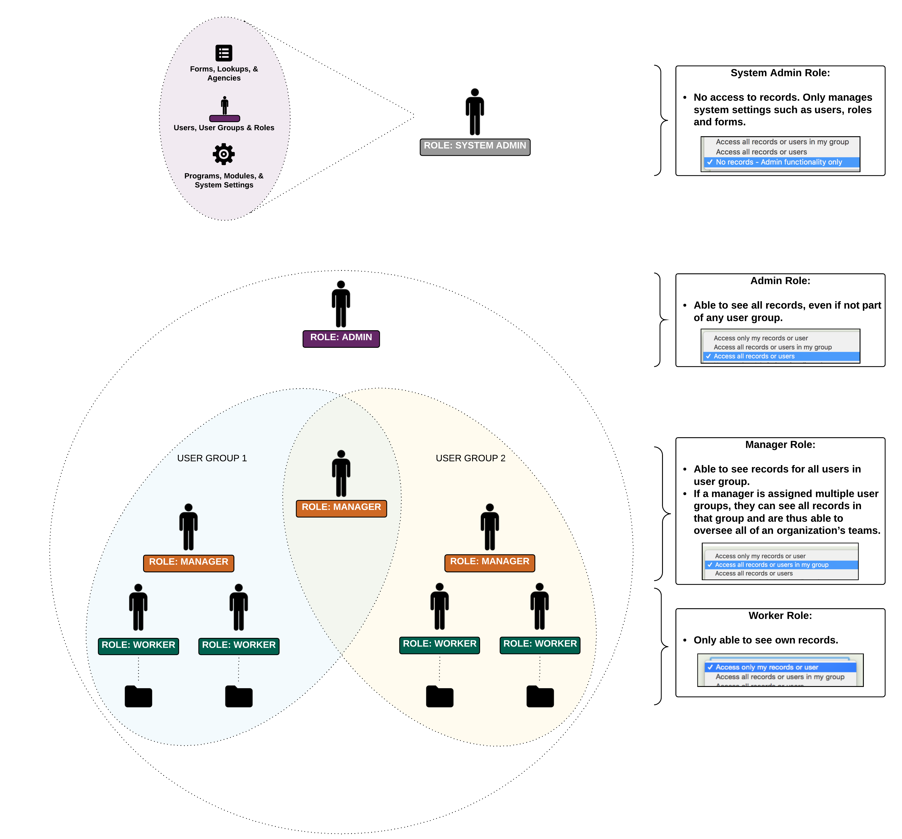

To create a new user group, use the following process:

1. Navigate to the Users page using the **SETTINGS** link in the navigation bar.

2. Select the _**User Groups**_ link in the left panel navigation.


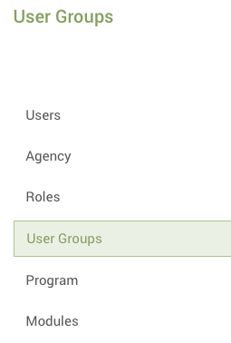

1. Use the CREATE USER GROUP button to bring up the creation form.

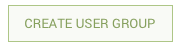

A name for the group is required; no other information is necessary. Click on the SAVE button once all the desired information is entered.

Membership to the User Group is given when the specific user is created. Access to the records of the group is determined by the role that user has.

To edit the name or description of an existing user group, find the name and click _Edit_ in the options in the right column. From the _Show_ page, click the EDIT button at the top of the screen. We highly recommend that a user group never be deleted unless it was created in error as this may have a negative impact on any users who have been assigned the group. Click on the SAVE button once all the desired information has been changed or entered.

## Creating and Editing Agencies

**Agency** is a required field for setting up users so these should be configured before creating users. This also configures the logo\(s\) that appear in the top right corner of the Primero application as shown below:

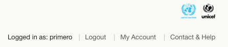

To create a new Agency, use the following process:

1. Navigate to the Users page using the **SETTINGS** link in the navigation bar.

2. Select the _**Agency**_ link in the left panel navigation.


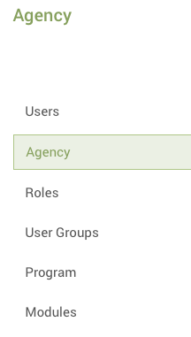

1. Use the CREATE button to bring up the creation form.

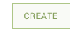

A name for the agency is required; no other information is necessary.

1. To add a logo for the Agency, use the BROWSE button to navigate through the files available and select the appropriate image.

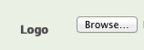

For the logo to appear at the top right of the screen in the Primero application, check the box at the bottom of the form as shown below and click on the SAVE button once all the desired information is entered.

## 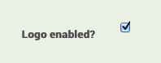 {#section-6}

To edit an existing agency, find the name in the list of agencies and click _Edit_ in the options in the right column. From the _Show_ page, click the EDIT button at the top of the screen. Click on the SAVE button once all the desired information has been changed or entered.

It is important to note that once an agency has been created, it cannot be deleted. The agency can only be disabled.

## Creating and Editing Users

**Users** are the individuals using Primero who each have a unique username and password. Before setting up users, the roles, user group and agency for that user must be set up. For each individual user, the following information is specified:

* Username - This should be unique across all the instances in the deployment.

* Password - Currently, there is no way for a user to reset their password so a standard password should not be given for all users with the expectation that they can change it.

* Role - Must be an existing role as defined in the section above.

* Modules - A user is given access to one or more modules in Primero.

* User Groups - Must be an existing user group or groups as defined in the section above.

* The agency is a required field as well.


To create a new User, follow these steps:

1. Navigate to the Users page using the **SETTINGS** link in the navigation bar.

2. Select the _**Users**_ link in the left panel navigation.

3. Use the **CREATE USER** action button to bring up the creation form:


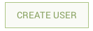

1. As described above, there are a few fields that are mandatory to create a user: Full Name, User Name \(must be unique\), Password and Reenter Password, and Organization, which is a dropdown selection list of the Agencies created above.

2. Then select none, one, or many roles, modules, and user groups for each user:

  a.  Role - sets the permissions of the user \(i.e. Edit, Flag, etc.\)

  b.  Module - sets access to which module for the user \(CP,GBV, etc.\)

  c.  User Groups - sets the hierarchy and shared information access for a user. This helps set the manager versus team member role and vice versa.


Click on the SAVE button once all the desired information is entered.

To edit an existing user, either find the name and click _Edit_ in the options in the right column from the list view or from the _Show_ page, click the EDIT button at the top of the screen. Click on the SAVE button once all the desired information has been changed or entered.

## Disabling and Deleting Users

We highly recommend that a user never be deleted unless it was created in error to avoid issues with record ownership or other negative impacts. Instead, it is recommended that a user access be disabled. Disabling a username will prohibit that username from being used to log in to Primero.

To disable a User, follow these steps:

1. Navigate to the Users page using the **SETTINGS** link in the navigation bar.

2. Select the _Users_ link in the left panel navigation.

3. From the list of users, find the username to be changed and click _Edit_ in the options in the right column. If the record for the Username is already open, click the EDIT button at the top of the screen.

4. Check the box at the bottom of the form as shown below to disable the Username and click on the SAVE button once all the desired information is entered.


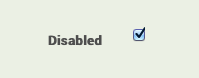

Although not recommended, if for some reason a user needs to be deleted, follow these steps:

1. Navigate to the Users page using the **SETTINGS** link in the navigation bar.

2. Select the _Users_ link in the left panel navigation.

3. From the list of users, find the username to be deleted and click _Delete_ in the options in the right column. The following confirmation box will appear:


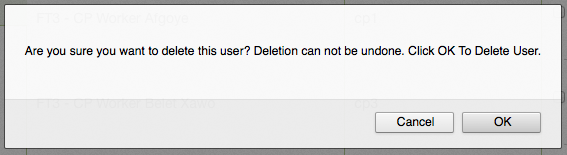

To delete the username, click on the OK button. To cancel and keep the username, click on the CANCEL button. This action cannot be undone so proceed with caution.

## Configuring Manager Dashboard

The modules that show up on the manager are cofigurable from the roles settings. To change the dashboard for a for a role, click on the **Settings** tab and click on **Roles**. Scroll down to the **Dashboards** section and here you can add or remove modules.

The new modules for version 1.4 are as follows:

* View Approvals
* View Assessment
* View Cases To Assign
* View None Values

## Referral Button

Version 1.4 adds a new referral button to a Response Overview. To have the button appear, the user has to have the permission **Refer Case from Service form** added to their role (this is disabled by default)

# Configuring Programs and Modules

Configuring Programs and Modules should not be done without the guidance of the appropriate Steering Committee. Site administrators should never configure or edit Programs and Modules without approval and assistance. Modules are higher level components in which country, regional, and international decisions need to be made for its purpose and use cases. While creating or editing Modules and Programs will not be a frequently-used feature, should it become necessary, the instructions are provided below.

## Configuring Programs

Programs represent a mandate for the application as provided by the steering committee for using Primero. As such, Site Administrators should never configure or edit Programs and Modules without approval and assistance. An example of a program is child protection work within certain zones of a particular refugee camp. In the current release, the program configuration only provides descriptive information about the application’s mission. While the Program does not currently impact application behavior or configuration, it could in future releases. In the default configuration of Primero, there is one program, Primero, it should not be edited or deleted.

To add Programs, with the understanding that this will have no impact and should be done with caution and guidance, follow these steps:

1. Navigate to the **SETTINGS** option in the main navigation bar.

2. Select the _**Program**_ link in the left panel navigation.


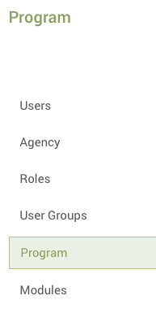

1. Use the **CREATE PROGRAM** action button to bring up the creation form:

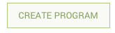

1. The only field that is mandatory to add a program is the Name of the program. The other fields such as Description, Program Start Date and Program End Date are optional. Click on the SAVE button once all the desired information is entered.

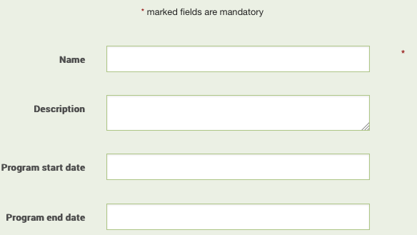

To edit an existing Program, either find the name and click _Edit_ in the options in the right column from the list view or from the _Show_ page, click the EDIT button at the top of the screen. Click on the SAVE button once all the desired information has been changed or entered.

## Configuring Modules

Modules represent how the system will be used and contain the default set of forms. Site administrators should never configure or edit Modules without approval and assistance. Primero will include the following default modules that should not be deleted:

* Child Protection \(CP\): This module includes child protection case management and tracing request capability to aid in family tracing and reunification.

* Gender Based Violence \(GBV\): This module includes case management and incident tracking for gender-based violence service providers.


Each module comes with module-specific components and a default set of forms and other configurations. While there appears to be some overlap between the modules - both CP and GBV have cases - each module has a unique set of forms. In some cases, fields, like name and date of birth, may be shared among the forms across modules.

To add more Modules, with the understanding that this should be done with caution and guidance, follow these steps:

1. Navigate to the **SETTINGS** option in the main navigation bar.

2. Select the _**Module**_ link in the left panel navigation.


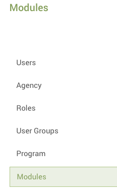

1. Use the **CREATE MODULE** action button to bring up the creation form:

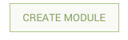

1. Name and Program are mandatory fields. At least one Associated Record Type must be selected. Once the Associated Record Type\(s\) is selected, the forms only field that is mandatory to add a program is the Name of the program. The other fields such as Description, Program Start Date and Program End Date are optional. Click on the SAVE button once all the desired information is entered.

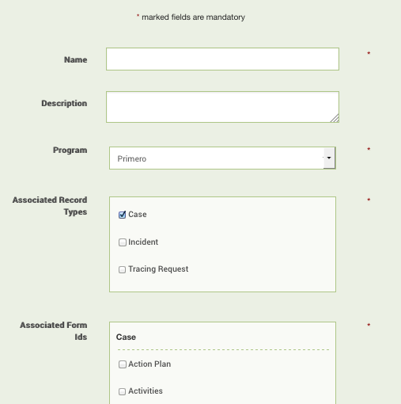

To edit an existing Program, either find the name and click _Edit_ in the options in the right column from the list view or from the _Show_ page, click the EDIT button at the top of the screen. Click on the SAVE button once all the desired information has been changed or entered.

## Name Field Auto-Population

A field can be set to auto-populate based on one or more other fields using the ```auto_populate_list```  in the configuration bundle or system_settings seed file. This is configured to auto-populate the *name* field with the first middle and last names by default.

* ```field_key``` sets the field to be populated.

* ```format``` sets the fields the values are pulled from.

* ```separator``` sets what goes between the pulled values.

* ```auto_populated``` sets if the field_key field is auto-populated.

# System Settings Configuration

System settings (```SystemSettings```) is part of the configuration bundle and is a collection of settings that affect the whole build.

## Age Range

Age range is set in the ```SystemSettings``` part of the configuration bundle by the ```primary_age_range``` property

* There are two arrays of age ranges primero and unhcr with unhcr being the default set by the ```age_ranges``` property

* The default age ranges are ```["0..4", "5..11", "12..17", "18..59", "60..#{AgeRange::MAX}"]```

## Reporting Location

In ```SystemSettings``` under ```reporting_location_config``` the ```hierarchy_filter``` replaces ```reg_ex_filter``` to filter locations. This should match the hierarchy array in ```Locations```

## Agency Code

The **Agency_code** is added to the "Case" on the top left of the case view (for example "FPD Case"). This is defined in the Agency lookup as the ```agency_code``` property and the display of the agency code is toggled by the module property ```agency_code_indicator``` (set to true by defalt). This is for developers modifying the configuration files.

## Search for an existing ID before creating a Case record
A new feature allows for searching for an existing case by ID before creating a new one.
This feature is active by default and is toggled by the ```allow_searchable_ids``` property in modules settings. This is for developers modifying the configuration files.

# Form and Field Configuration

A **form** contains a set of fields for a record. By configuring the Primero application, you can create a new form, modify the existing forms, specify new fields on a form, reorder the fields, or allow different forms to share the same field. Forms are organized by components - Cases, Tracing Requests, and Incidents - and Modules - CP and GBV.

A **field** \(data field\) is information within a record. Fields are attributes like name, age, date of birth. Sometimes one field can be used to store several values like a list of protection concerns or all the languages spoken. The same field can be ‘shared’ on different forms so that you can enter a date of birth on one form and see it on multiple forms. Fields can only be shared within a component, such as Case. A field cannot be shared across components, such as Cases and Tracing Requests. There are a variety of Field types that are available including:

* Text

* Text Area

* Date

* Tick Box

* Select Drop Down \(single-select and multi-select\)

* Radio Button

* Numeric Field

* Tally Field

* Date Field / Date Range

Forms are created first and then the fields on those forms are added once the form is created. Forms can only be created or modified by a user with the appropriate permissions. The following sections describe how to configure the forms and fields within Primero.

## Creating and Editing a New Form

It may be necessary to create a new form when the core set of forms does not satisfy the needs of documenting something within a case, incident or tracing request.

To create a new form, follow these steps:

1. Navigate to the **FORMS** link in the top navigation bar.

2. Within the Form Builder, select the proper form set using the drop downs for record type and module \(i.e. Case and CP; Incident and GBV; etc.\)


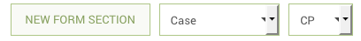

1. Once in the proper form set, select the NEW FORM SECTION actionbutton in the anchored header.

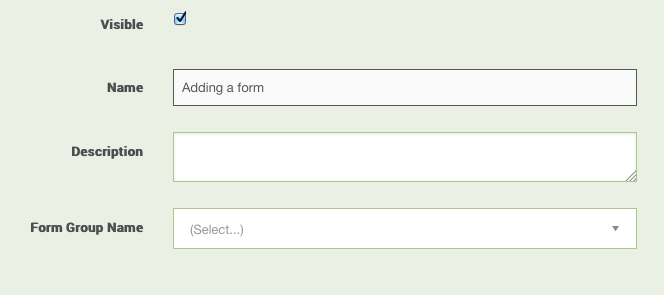

1. Fill in the following information about the form:

2. Form Name - this is the name of the Form that will appear in the List of Forms in the Left Navigation panel.

3. Description - this a description of the Form and is not displayed

4. Form Group Name - this is the name that displays in the Left Navigation Panel at the top level when forms are grouped. The Form Group has a dropdown carrot to the right of the name in the Left Navigation Panel. Clicking on this carrot expands or contracts the Form Group. To add the Form Group Name, you can select an existing Form Group from the dropdown list or add a new one. To add a new one, type the desired name in the box directly below the field and then click on the phrase ‘Click to add &lt;form group name&gt;‘ directly below that:


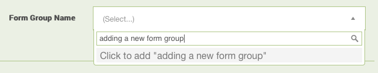

If you want the form to appear by itself and not as part of a group at the top level in the Left Navigation Panel, you must enter same the Form Name in the Form Group Name field by using the instructions to add as described above.

* The system will default to making this form visible. If you do not want it visible, simply uncheck that tick box.

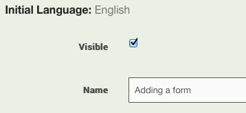

1. Press SAVE when all the desired information is entered.

Once you have saved the form, you can add fields to the form using the instructions below.

To edit an existing Form, either find the name in the list of forms and click _Edit_ in the options in the right column from the list view, or from the _Show_ page, click the EDIT button at the top of the screen. Click on the SAVE button once all the desired information has been changed or entered.

## Creating and Editing Fields on a Form

You must create and save the Form before you are able to enter the fields to be displayed on the form. Once you have saved the Form, you will see the following at the bottom of the form creation page:

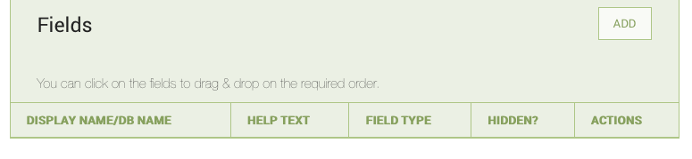

To add a field to the form, select the ADD button, the following will appear:

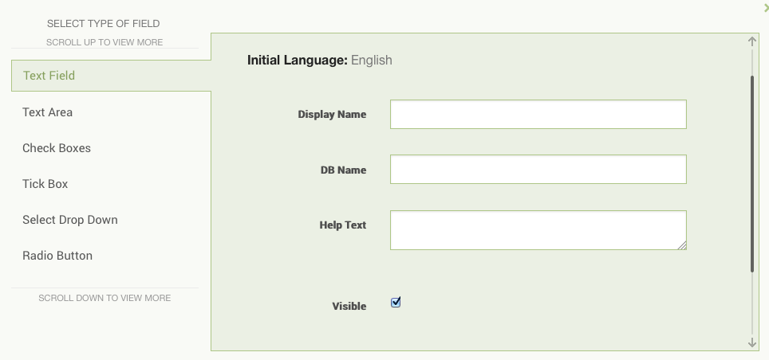

There is a SAVE button to save the changes to the field but you must also save the form after fields have been added. The left navigation panel in this window, lists the types of fields that can be added to a form \(below\).

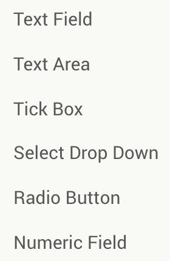 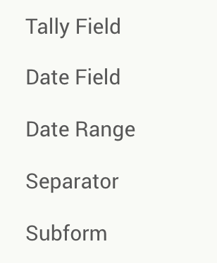

Once a type of field is selected, the fields required to create that type of field will appear. All field types will ask for at least the following:

* Display Name - This is the name that will display on the form

* DB Name - This is the name for the database field. If you leave this blank, the application will name the database field for you. This is important to note if you want to share fields as described later.

* Help Text - The help text will appear below the field and only in Edit mode. The help text is not visible when you are only viewing the record. This allows you to provide some guiding language to give the user a frame of reference for the proper answer or how to come to a conclusion based on information provided.

* Visible - Use this indicator to have the field show on the form \(check the checkbox to do this\) or hidden on the form. It is highly recommended that you hide unwanted fields rather than delete them. The exception is in the case of a field created in error or duplicated. Once a field has been in use, it is preferable to hide it rather than delete it.


When you have entered all the information for the field, press the SAVE button at the bottom of the field modal to save the field. You must also save the form using the SAVE button at the top of the page.

A brief description of each field type and any additional information to build the field is detailed below:

* **Text Field -** A Text Field is used for brief pieces of text.Unlike a Text Area, it will not expand to fit the text entered. Text will not be truncated but it is not easy to view.

* **Text Area -** Unlike a Text Field, a Text Area will expand to fit the text entered. A Text Area field is differentiated by the hash marks in the bottom right corner:


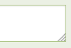

* **Tick Box -** A tick box is a checkbox with one selection as shown below:

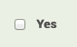

Tick box inputs will display in Edit mode. In “View” mode, only the text of the option will appear. In some cases, even when the tick box is not selected, the opposite value will show in “View” mode. For example, if the value of the tick box is ‘Yes’ and it is unchecked, the field may contain ‘No’ in “View” mode.

* **Select Drop Down** - A select drop down field allows the user to pick a value or values from a defined list of options as shown below:

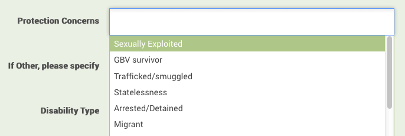

To configure a select drop down, there are some additional fields in the window:

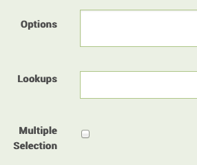

The “Options” field is one way to configure the list of items that a user will see when they access this field. To add options, each option must be on a separate line. The Lookups field is a way to indicate that the list of items should come from a Lookup, which is a list of items that may be referenced by multiple fields. For instance, fields such as “Nationality,” “Ethnicity,” or “Language” have potential values that are consistent across Primero. The Lookup must be created before the field. See the section on Lookup Management for instructions. The “Multiple Selection” check box indicates if the user is allowed to pick more than one item from the list. If the box is unchecked, only one selection is allowed. In cases where there are a large number of options, the user will be able to begin typing upon clicking the dropdown, and options that match the entered text will appear. To select an option, the user can either click on an option or simply hit enter to choose the currently selected item.

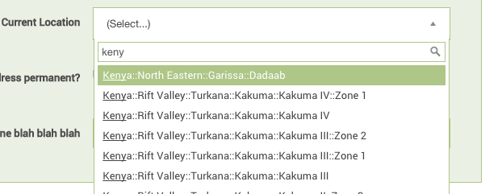

* **Tally Field** - The tally field is used to record a count for several different pieces of information. For instance, if I wanted to know how many children and how many adults were living in a given household, I could create a tally field with “Children” and “Adults” as fields.. For a tally field, you can specify up to three fields:

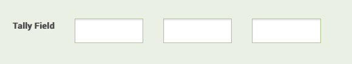

The application will automatically add the three values and display a total.

* **Date -** The date field type will automatically validate that what the user enters is a valid date field. The standard date format for Primero is dd-mmm-yyyy.

* **Date Range -** The date range type allow the user to enter a “From” and “To” date as shown below:


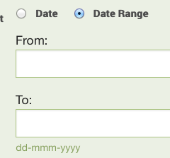

Within a form there are two additional field types that are unique from other field types and they are used for different purposes:

* The **Subform**, also referred to as a Nested form, is a section of a form where a user can collect the same set of data for multiple occurrences within the same case, incident or tracing request. This is used throughout Primero to collect information where a case may have multiple follow up visits, protection concerns etc..
  For example, when recording a child’s living situation in the “Care Arrangements” form, a worker may fill out the same “Care Arrangement” subform each time the child’s current arrangement changes.

* A **Separator** identifies a new section within the form. For example, on the ‘Closure’ form, a separator marks the address portion of the form to set it apart from the rest of the fields on the page. This is not a sub-form because you only need to enter information into it once.


A Subform is created in two steps, first you need to add the Subform field type to the Form where the Subform should appear. Second, click _Edit Subform_ from the list of fields to add the fields for the subform.

## Editing an Existing Form

Similarly to creating a new form, you can edit an existing form to show, hide, or change existing fields. You should only change fields which are outside the **core data set.** This means the fields that are inherent to the Primero deployment when you first receive it should not be edited, but can be selected to be invisible in the form and field level forms.

1. Navigate to the Form Builder using the **FORMS** link in the navigation bar

2. Within the Form Builder, select the proper form set using the drop downs for record type and module \(i.e. Case and CP\)

3. The existing forms will show in the list view. Find the desired form to edit, and click the “_Edit_” link in the far right column

4. Once in edit view of the form, scroll to the field you’d like to edit, or add a new field as described earlier.


### Change an Existing Field

The functionality to change a field from one type to another is currently not supported. It is necessary to create a new field with the desired type and then hide the field you are replacing. If you want the data in the existing field to appear in the new field, make note of the database name of the existing field. Create a new field with the proper type and use the existing database name. You will need to create a unique field label - the text that appears on the page. Once this is done hide the field you are replacing.

### Change the Field Order within a Form

You may click and drag a single field to anywhere in the form to change the order in which they appear on the form. You must do this one field at a time.

### Change the Form Group

While creating or editing a form, to add a new form group, type the name of the new form group in the field. The following will appear:

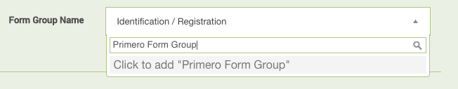

Use the mouse to click “Click to add” and it will create a new form group name.

## Lookup Values Management

“Lookup” is the term used for a set of values that might be used in the dropdown selection for multiple fields. For example, it may be more efficient to define the values for fields such as “Language,” “Ethnicity,” and “Nationality” once and then reference them for several fields throughout Primero. This will ensure certain data points are consistent and improve data entry speed and accuracy.

To create a new Lookup:

1. Navigate to the Form Builder using the **FORMS** link in the navigation bar

2. Select the **NEW LOOKUP** action button in the anchored header. The following will appear:


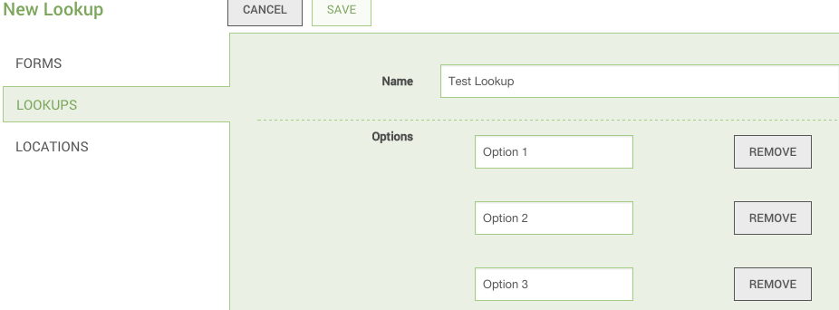

1. Add a name for the Lookup you are creating.

2. Add a single option in each “Option” field adding new fields or removing as needed.


Once a Lookup is created, you can add to a field type and select whether you can pick one or more of the values.

To edit the properties of an existing Lookup, find the name and click _Edit_ in the options in the right column. From the _Show_ page, click the EDIT button at the top of the screen.

## Jordan Case Identity

* The ID in the cases list rows is either in the format ```case_ID_code/short_ID``` or just ```short_ID``` if the case_ID_code isn't set. This is set as an auto-populated field in the ```SystemSettings``` (this is for developers working on a configuration bundle)

# Alerts sand Notifications

Alerts are a way of letting the case owner know when someone else has changed something in a case such as updating a field in a form, adding an incident, adding service provision, or requesting approval for a form. Alerts appear in the form of a message at the top of the associated form with a red "!" next to the form name in the form selection side bar.

* In ```SystemSettings```

  * toggle show_alerts to hide or show all the notifications. This includes the case sidebar form indicators and the messages in the form view for new subforms (incidents and service provision), approvals (BIA, case plan, case closure), and changed forms (currently only for service detail forms)

  * ```approval_forms_to_alert``` is a map that is used to associate form ids with approval alert types

  * ```changes_field_to_form``` is a map of field names to forms (either one field to one form or one field to an array of many forms is accepted structure). This is used to decide which fields will trigger an alert for a form when changed by someone who isn't the case owner.

# Permissions

## Create a CP Incident from a CP Case

This is a new permission to allow creating an incident details from a case you don't own. Add ```Permission::INCIDENT_DETAILS_FROM_CASE``` to the role you want to give this permission to.

## Create services details from a case

This is a new ppermission to allow adding a service provision form to a case you don't own. Add ```Permission::SERVICES_SECTION_FROM_CASE``` to the role you want to give this permission to.

# Rules for Importing Data into Primero

Importing information into Primero is a strict process. This helps make sure that data is not incorrectly input into the system. There are some rules as to how and what you can import:

* Imports from a Primero instance to a Primero instance must be “Primero file format” \(or JSON\)

* CPIMS Imports to Primero must be done via a migration following the migration steps outlined in a separate document.

* Imports from the GBV Incident Recorder to Primero must be done via CSV using the migration steps outlined in a separate document.

* CSV files can be used for importing but must be done by an administrator. This format will:

  * Update existing records using the Long ID field

  * This format should not be used for creating new records

  * Requires that any data being imported is strictly formatted according to the existing values in Primero - Locations, Protection Concerns, Violation Types, etc.


* If you are performing an initial migration of data, then be sure that you have decided on and loaded your configuration before making changes to your migration file and importing it. Failing to do so can cause you to lose data in fields whose database names have changed in the configuration.


For additional questions or concerns, you may discuss with your site administrator or the proper authority.

## Protection Concerns

* If you're looking to explicitly set the ids of protection concern options, this can be done by editing the lookup in the configuration under ```lookup-protection-concerns``` in the configuration bundle (this is for developers).

# Exporting and Importing the Configuration Bundle

Configuration Bundles allow you to export and import the configuration for a Primero instance. This allows you to duplicate the configuration of one instance and can greatly simplify the setup of a new instance by exporting the desired configuration from an existing instance and importing it into the new instance. The Configuration Bundle includes all other data in the system except for the record data itself. Everything under the **FORMS** option from the main navigation bar and everything except _**Users**_ under the **SETTINGS** option is included in the Configuration Bundle. There is a separate export and import process for Users which is described in the next section.

A bundle import will preserve any existing data that isn’t part of the import, but will overwrite data that is part of the import. For example, if you had an agency _IRC_ in an instance and then imported a Configuration Bundle with the agency _Save the Children_, you would have an instance with both of those agencies. If you had an existing agency _Save the Children_ with a telephone of _+1-555-555-5555_ and the same agency in the bundle had a telephone of _+1-444-444-4444_, the latter phone number would exist in the system after a bundle import.

## Exporting the Configuration Bundle

To export the Configuration Bundle, login in as a user on this instance with permissions to access the **SETTINGS** option in the main navigation bar. Select the **SETTINGS** option from the main navigation bar. While on the _**Users**_ form in the left navigation list, you should see the Action button with the options to Export as shown below:


To export a Configuration Bundle from an existing instance:

1. When logged in as the System SuperUser or another user with access to the **SETTINGS** option, select that option from the main navigation bar at the top of the screen. The _**Users**_ form in the left navigation list will be selected by default; remain on this option.

2. From the ACTION BUTTON, select the _Export_ option and then the _Configuration Bundle_ option. You will then be presented with a popup window asking you for a password and an optional file name.


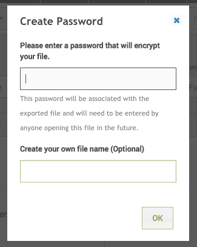

A password is required and it is highly recommended that you choose a strong password that you can remember. A filename is optional. After completing the password field, click on _OK_ and you should receive a zip file containing the Configuration Bundle. If you do not enter a filename, the filename will start with ‘configuration\_bundle’ and end with ‘json.zip.’

It is highly recommended that if the Configuration Bundle is to be distributed, the zip file that is encrypted and password protected be distributed and the password sent separately rather than distributing the extracted, unencrypted file.

## Importing the Configuration Bundle

To import a bundle from another instance, you will need the zip file created in the export step and the password for that file. However, before doing the import, you will need to extract the _.json_ file from inside the zip file that you received when you exported the Configuration Bundle in the previous step. Once the file is extracted, use the steps below to import the configuration into the desired instance.

To import the Configuration Bundle, login in as a user with permissions to access the **SETTINGS** option in the main navigation bar. Select the **SETTINGS** option from the main navigation bar. While on the _**Users**_ form in the left navigation list, you should see the Action button with the options to Import as shown below:

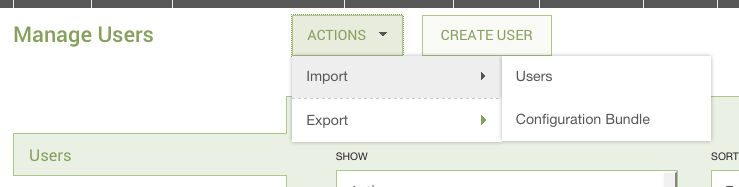

To import a Configuration Bundle from a file:

1. When logged in as the System SuperUser or another user with access to the **SETTINGS** option, select that option from the main navigation bar at the top of the screen. The _**Users**_ form in the left navigation list will be selected by default; remain on this option.

2. From the ACTION BUTTON, select the _Import_ option and then the _Configuration Bundle_ option. You will then be presented with a popup window asking you for a file name.


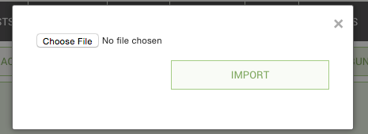

This is the _.json_ file that was contained inside the zip file that you received when you exported the Configuration Bundle in the previous step. You cannot upload the zip file itself, however, since it is encrypted. Therefore, you must extract the file out of the zip file to a known location on your computer, and then find it and select it in the import popup window. To do this, double click the zip file, enter in the password for the exported file and your computer will open a .json file. Select this file for import. After clicking _OK_, the system will process for a moment and then present you with a message whether the import succeeded or failed. \(Please note that it may take a few seconds for all your configuration changes to load once you have imported the configuration bundle. If you do not see your changes show up immediately, wait fifteen seconds or so, reload your page, and check again.\)

### Troubleshooting the Import of the Configuration Bundle

###  {#section-11}

Sometimes a bundle import will succeed and the ‘File was imported successfully’ message will appear, but the process does not apply the full set of bundle changes. For example, some Forms or Lookups may go missing. If that is the case, the bundle will need to be reapplied again using the Import process until the full set of configuration changes are observed. It helps to keep a list of expected Forms, Lookups, and Roles and then double check that this list appears in the configured Primero instance. It is important to note that existing core case and incident data will not be erased if the bundle is partially applied.

## Testing the Configuration Bundle

Once a configuration bundle imports successfully or any changes have been applied, it must be tested to make sure the new fields and formats are correctly configured. The best way to verify your changes is to simply save a record. Either open a new record, or edit an existing one. From here, try to make changes to all different field types: Add an item to a multi-select, check a tick box, add a value for a date of birth. Be sure, as well, to add entries to nested forms on form sections such as Family Details. As you are going through the various form sections, also take a minute to make sure that the fields look the way you imagine they should look. When you click on a drop down, do the options you specified for that drop down appear?

Below is an example of simple steps that can help in this verification:

* Navigate to the form\/fields that were changed or added

  * Are they in the right location\/group?

  * Are they the right type of field\/form?

  * Are the labels correct?

  * If you have chosen to hide in view page, does it hide correctly?


* Add similarly formatted test information into each of the new fields and forms and save \(example: do not attempt to add “Old” in Age field, add the type of information the form is expecting\)

  * Does it save properly?

  * When you navigate away from the form, then back, is any information lost?


* Export the form\/fields you created into Excel

  * Did they show up in your export correctly?


When you are finally done adding information to your record, save it, and see if your information saved correctly. If they did, and you have encountered no errors, try creating and then exporting a report as well. If all of this proceeds without error, it is time to export a configuration bundle so you can save the changes you have made so far.

# Exporting and Importing a Group of Users

User import and export is a similar process to the Configuration Bundle. This functionality only applies to Users. This function exports and imports all users in the instance; you cannot pick users to export or import. Also, it does not export the underlying building blocks of Users

* Agencies, Roles and User Groups. These can be exported and imported
  using the Configuration Bundle functionality described above.

## Exporting a Group of Users

To create the User Export, login in as a user with permissions to access the **SETTINGS** option in the main navigation bar. Select the **SETTINGS** option from the main navigation bar. While on the _**Users**_ form in the left navigation list, you should see the Action button with the options to Export as shown below:

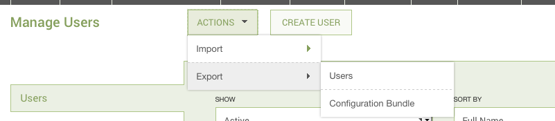

To create a User Export from an existing instance:

1. When logged in as the System SuperUser or another user with access to the **SETTINGS** option, select that option from the main navigation bar at the top of the screen. The _**Users**_ form in the left navigation list will be selected by default; remain on this option.

2. From the ACTION BUTTON, select the _Export_ option and then the _Users_ option. You will then be presented with a popup window asking you for a password and an optional file name.


A password is required and it is highly recommended that you choose a strong password that you can remember. A filename is optional. After completing the password field, click on _OK_ and you should receive a zip file containing the user export. If you do not enter a filename, the filename will default to ‘primero\_user.json.zip.’

It is highly recommended that if the User Export is to be distributed, the zip file that is encrypted and password protected be distributed and the password sent separately rather than distributing the extracted, unencrypted file.

## Importing a Group of Users

To import a User Export from another instance, you will need the zip file created in the export step and the password for that file. Unlike the import for the Configuration Bundle, the user import accepts the zip file without the need to extract the .json file; however, you must provide the password for the file in the import prompt.

To import the User Export, login in as a user with permissions to access the **SETTINGS** option in the main navigation bar. Select the **SETTINGS** option from the main navigation bar. While on the _**Users**_ form in the left navigation list, you should see the Actionbutton with the options to Import as shown below:


To import a User Export from the zip file:

1. When logged in as the System SuperUser or another user with access to the **SETTINGS** option, select that option from the main navigation bar at the top of the screen. The _**Users**_ form in the left navigation list will be selected by default; remain on this option.

2. From the ACTION BUTTON, select the _Import_ option and then the _Users_ option. You will then be presented with a popup window asking you for a filename and password.


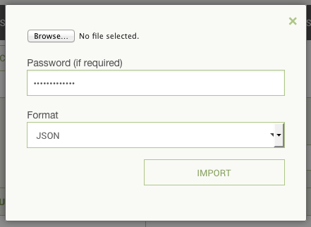

The file should be the encrypted export file, which defaults to the filename ‘primero\_user.json.zip’ unless another name was specified during the export process.

Enter in the password for the exported file and do not change the format type. After clicking _OK_, the system will process for a moment and then present you with a message whether the import succeeded or failed.

# Exporting a Blank Nested Form for an Existing Case

Exporting a blank Nested Form in PDF format allows you to print out additional paper Forms to take into the field to record additional occurrences of the Form contents, such as an additional family member on the Family Details nested form within a CP Case.

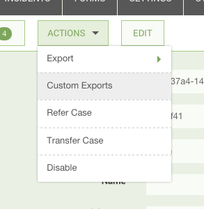
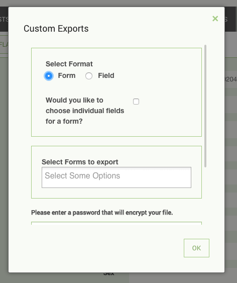

From within the Case use the Export option under the Action button, select Custom Export and then you must select the corresponding “Nested Form Name.” An easy way to do this is to type “nested” in the Select Forms to Export field. This will filter the form list and show those that starts with “Nested” as shown below:

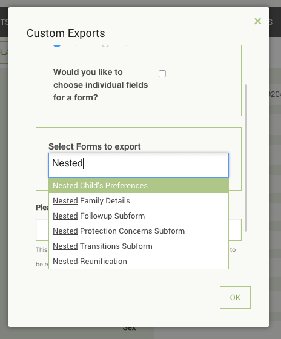

Select the desired nested form and complete the export to PDF format. The PDF will contain all the forms for that case record as well as the blank nested form. Do not select any of the non-nested forms. If you select a non-nested form, you will get all the information for the case without any blank forms.

# Testing Administrative Changes and Data Loads

It is recommended to test out on a local instance any large bulk change to the system before applying it to the global production instance. Such risky bulk changes may include:

* Applying a customization bundle

* Loading large numbers of records

* Running migrations


Additionally, experiments with forms, Lookup values, and Report creation can be safely performed on a test instance to minimize any potential disruptions to all Primero users from misconfigured Forms or Reports with poor performance.

## Test instance

A test instance can be set up and configured for the express purpose of validating potentially disruptive updates to Primero as follows:

* The instance can be a local laptop or desktop installation of Primero. Local instances are quick to set up and isolated from production. To do this, use the Installation instructions listed in a separate document.

* Make sure this instance is the same version of Primero as the centrally hosted instance.

* This installation of Primero should not be, under any circumstances, configured to be synced with the central Primero server. This will protect the central server from any potential damage and experimentation on the test instance.

* The base state of the test instance should be the same as that of the central production instance. To that end make sure that:

  * The configuration is identical – achievable by an earlier import of the production Configuration Bundle

  * The underlying data is the same - or reasonably close. This can be accomplished by exporting data as JSON from the central instance and importing into the test instance.


It is recommended that any deployment have at least one test instance for the administrator to validate system-wide changes.

## Testing

Once a test instance exists, the administrator can apply the changes and manually validate the expected results. The following are good areas to spot check:

* Are all the records loaded? If the import file contains 3000 new records, do we have 3000 new records?

* Are all of the expected fields populated? Do we have names, ID numbers, bio data, locations, service information, and so on?

* Have the Lookup field values been correctly imported? Primero will not display imported Lookup field values that do not correspond to already configured Lookups or field options for a particular field.

* If importing a Configuration Bundle:

  * Check that expected fields and forms are present.

  * Check that the expected Lookups and locations are present.

  * Validate that the expected Roles exist

  * Try creating or editing a Record. Validate that it can be saved.


## Designing Forms and Lookups

It is recommended that configuration design take place on a separate test instance. This will buffer live end users from experiencing potential errors from misconfigured forms and roles. Once the configuration has been successfully modified, it can then be applied to production as an import of the Configuration Bundle.

# Security Certificate Issues

Although we expect Primero instances to have SSL certificates associated with each deployment, that may not always be true. If so, there are some additional steps required to gain access to Primero. Depending on the browser, you will have to add Primero to your exceptions, “accept risks”, or “proceed.”

## Security Certificate Issues on the Chrome Browser

When you access Primero using the Chrome browser, you may receive the following message:

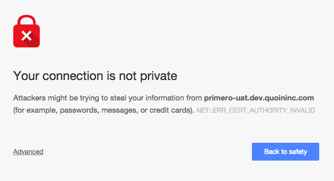

* Click Advanced on the Privacy Error Page. The following will appear

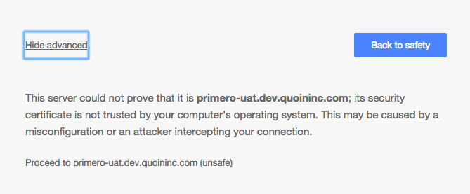

* Click the “Proceed to…” link at the bottom of the window. You will be redirected to the Primero login page

## Security Certificate Issues on the Firefox Browser

When you access Primero using the Chrome browser, you may receive the following message:

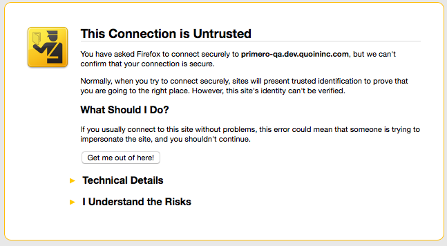

* Click “I Understand the Risks” and the window will expand to include the following:

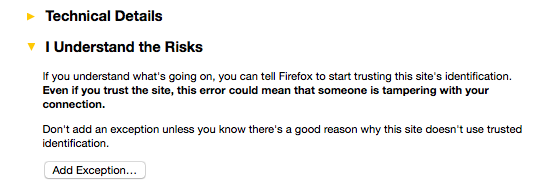

* Click “Add Exception…” and the following window will appear:


* Click “Confirm Security Exception.” You will be redirected to the Primero log in page.

## Security Certificate Issues on the Internet Explorer \(IE\) Browser

When you access Primero using an Internet Explorer browser, you may receive the following message:


* Click “Continue to this website \(not recommended\).” You will be redirected to Primero log in page.

